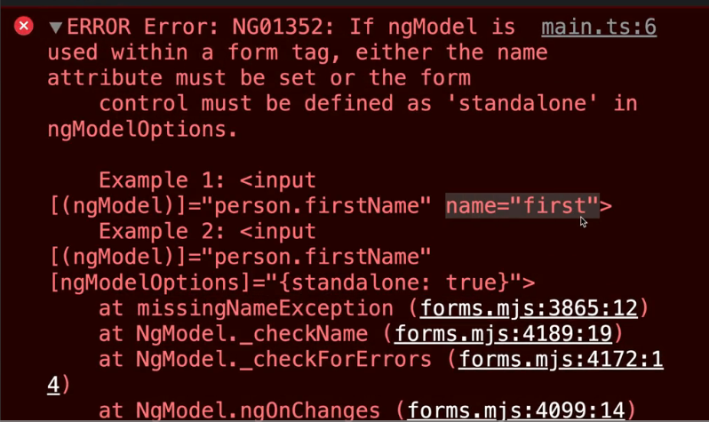

## [ngClass]=""

- Significa "estas clases aplicalas a tales elementos".
- En el archivo "list.component.html" usamos esta directiva en combinacion con el ngFor para darle un color distinto a cada fila de personaje:

``[ngClass]="{
        'list-group-item-success': isEven,
        'list-group-item-danger' : isOdd,
      }">``
 
- A las filas que tenian una posicion par, se les asignaba una clase que pintaba la fila de color verde y a las impares de color rojo.

## ([ngModel])=""
- Aca se esta usando el concepto de "two way data binding", enlazado de doble via, que significa que lo que modificamos en el HTML se va a guardar en la instancia de la clase, y lo que se modifique en tal clase, se va a ver reflejado en el html.

- Recordar que [] es para asociar un atributo y () es para asociar un evento.
 
- Y para usar esta directiva "ngModel" debemos agregar la libreria de "FormsModule" de Angular en el modulo, exactamente en la seccion de "imports".
 
- Cada input debe tener el atributo 'name="<nombreAtributo>". Angular nos obliga a ponerlo, si no, nos tira el siguiente error por consola:

Aunque si queremos no poner el atirbuto 'name', ya sea porque se va a mentener de manera aislada, sin referenciarlo a un 'name' podemos hacer:

